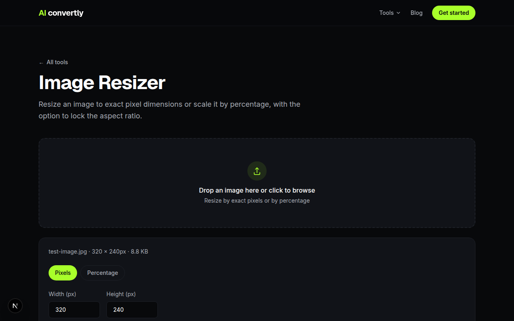

iLoveIMG is a genuinely solid set of image tools, and it's popular for a reason. So why look for an alternative at all? Usually it's one specific friction point: hitting a daily conversion limit on the free tier, getting nudged to create an account for a feature that used to be free, or just wanting a resize done without an ad-supported page reloading around you. If any of that sounds familiar, here's what the alternatives actually look like, AI Convertly included, with the tradeoffs stated plainly rather than glossed over.

## AI Convertly's Resizer

For a straightforward resize, drop the image in, set exact pixels or a percentage, and download.

There's no account, no daily cap, and no upload of your file to be stored anywhere; the resizing happens in your browser itself. That's the real advantage over an account-based service: nothing about your image or your usage gets logged server-side, because there's no server-side processing step to log it at.

The honest limitation: AI Convertly is a focused toolset. Resize, compress, convert format, strip metadata, a handful of others. It's not trying to be a full image editor.

## Where iLoveIMG Is Genuinely Better

iLoveIMG covers more specialized ground: cropping to a specific shape, watermarking in bulk, a meme generator, rotating and resizing PDFs alongside images in the same suite, and batch tools that handle dozens of files with more workflow options around each step. If your task is something like "watermark 40 product photos with our logo," that's squarely iLoveIMG's territory, and pretending otherwise would be dishonest.

*(Screenshot pending: iLoveIMG's site couldn't be reached during this pass.)*

Where it gets less convenient is exactly the friction points above: some tools require signing in past a certain usage, and the site runs on ads, which is a completely reasonable way to fund a free service, just not what everyone wants when they need one quick resize.

## Other Options Worth Knowing

- **Squoosh** (Google's own browser-based compressor) is excellent specifically for fine-tuned compression with a live before/after preview, though it doesn't do batch processing.
- **Your OS's built-in tools** (Preview on Mac, Photos on Windows) can resize a single image in a pinch without opening a browser at all, though neither handles batches or gives you percentage-based resizing cleanly.

## Which One Should You Actually Use?

For a single resize or compress with no account and no upload, AI Convertly is the faster path, plainly. For bulk watermarking, cropping to specific shapes, or working across PDFs and images in the same session, iLoveIMG's broader toolset earns the extra steps. Most people doing occasional single-image work are better served by the account-free option; anyone running recurring batch workflows across many files will get more out of iLoveIMG's deeper feature set.
