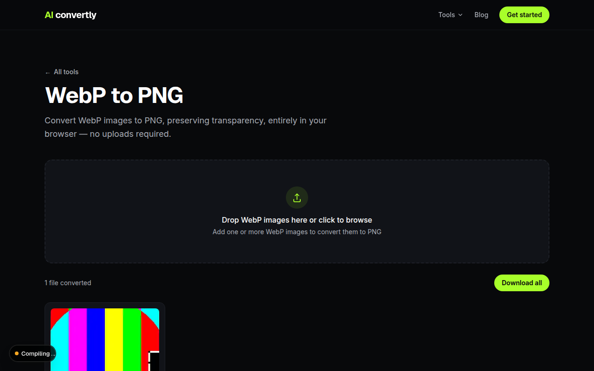
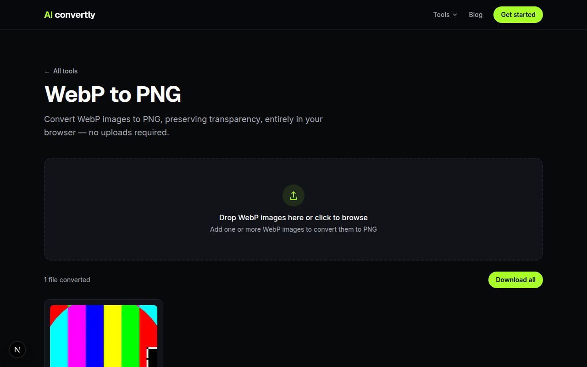

You saved an image from a website, and now it won't open. The file ends in `.webp`, and whatever app you tried, from an old photo viewer to a design tool you've used for years, just refuses to load it. This is one of the more common format headaches on the web today, and it has a quick fix.

## Why WebP Files Won't Open

WebP is a modern image format Google introduced for the web. Browsers use it constantly because it produces smaller files than JPEG or PNG at similar quality, which means faster page loads. That's great for websites. It's less great the moment you right-click "Save Image" and try to open the result somewhere that predates WebP support, which is still a lot of software: older versions of Windows Photo Viewer, plenty of design tools, and any app that hasn't been updated in the last few years.

The fix in almost every case is the same: convert the file to PNG, a format basically everything can open.

## 1. Convert It Online (Fastest, No Install)

The quickest path is a browser-based converter that handles WebP specifically. Drop the file in, get a PNG back, done, no account and no software to install.

Once it's converted, you can download the PNG directly.

Because this runs entirely in your browser, the file never actually leaves your device, which matters if the image is something you'd rather not upload to a random server.

## 2. Open It in a Browser First

If you just need to *see* the image rather than convert it, every modern browser (Chrome, Firefox, Edge, Safari) opens WebP natively. Drag the file into a browser tab, or right-click it and choose "Open with" your browser. From there you can right-click the displayed image and save it back out as PNG using the browser's own save dialog on some systems, though this isn't as reliable as a dedicated converter for preserving quality.

## 3. Check If Your OS Already Supports It

Support has improved a lot recently, so it's worth checking before reaching for a converter at all.

- **Windows 11** (and recent Windows 10 updates) can view WebP in Photos natively, provided the WebP Image Extension is installed from the Microsoft Store, which happens automatically on most modern installs.
- **macOS** (Big Sur and later) opens WebP directly in Preview and Quick Look.

If your system already opens the file, you likely only need to convert it if a specific older app still refuses WebP, which brings you back to option 1.

## 4. Other Converters

Plenty of other online converters handle WebP to PNG as one of many supported formats, and most work reasonably well for a single quick conversion. The tradeoff is usually that they're built for dozens of formats at once, so the WebP-specific path can be buried a few clicks deeper, and some cap file size or add a queue for free use. If you're converting WebP files specifically and often, a tool built around that one conversion tends to be faster to get back to.
